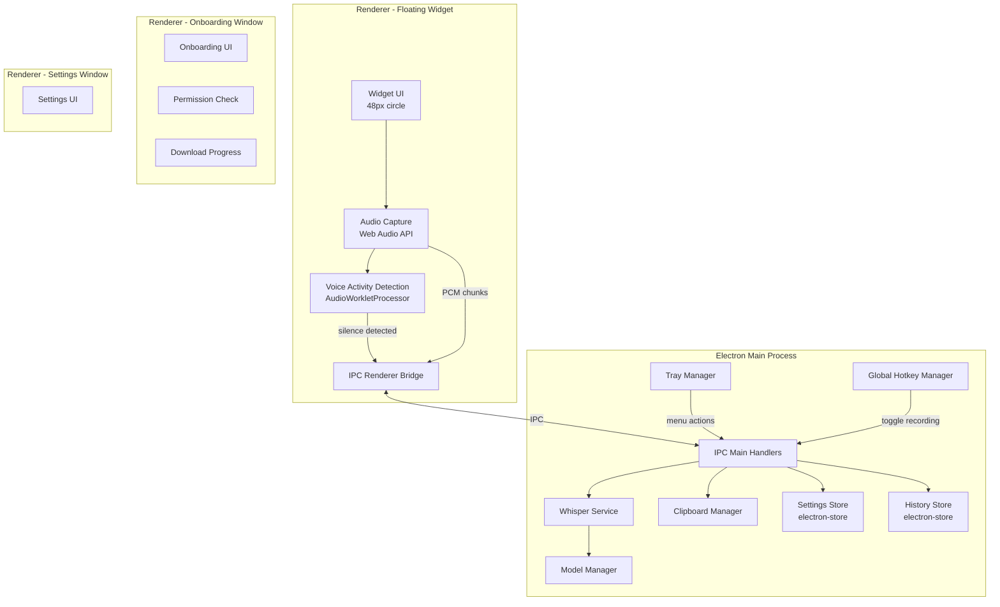
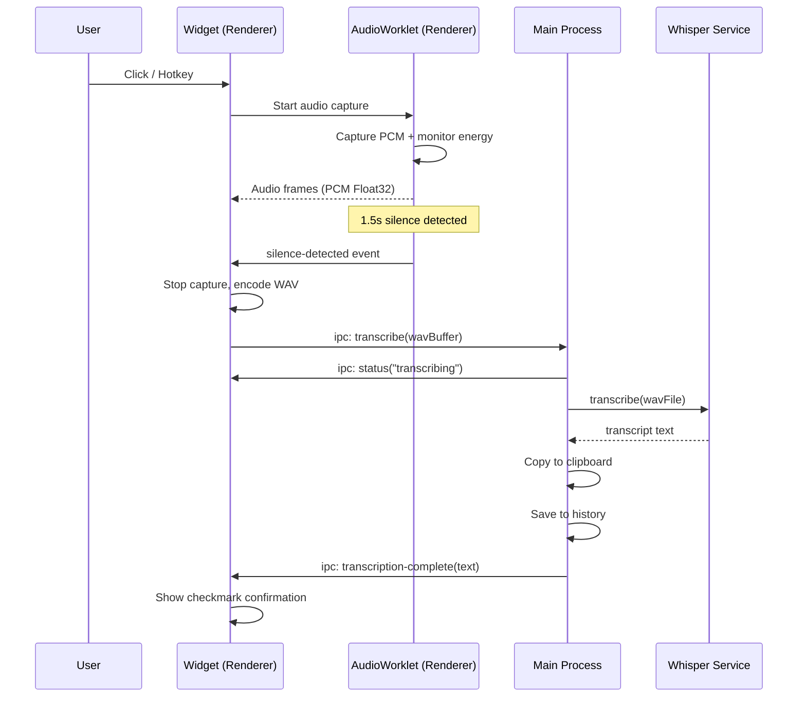

# Design Document: Desktop Voice-to-Text

## Overview

This design describes a lightweight Electron desktop application that provides always-available voice-to-text transcription using a local Whisper model. The app presents as a small 48×48px floating circular widget near the bottom of the screen — click to record, auto-stop on 1.5s silence, and the transcript is instantly copied to clipboard. No main window is needed for daily use. A system tray icon provides access to settings, history, and quit.

The existing Next.js web app at `apps/desktop/` remains unchanged. The Electron app lives at `apps/electron/` as a separate package in the monorepo.

### Key Technical Decisions

1. **Whisper Integration**: Use `nodejs-whisper` (Node.js bindings for whisper.cpp) running in the Electron main process. This provides native C++ performance on CPU without requiring Python or external runtimes. Models are ggml-format files downloaded from HuggingFace.

2. **Audio Capture**: Use the Web Audio API (`navigator.mediaDevices.getUserMedia`) in the renderer process to capture microphone audio. The renderer collects PCM samples via an `AudioWorkletProcessor` and sends them to the main process over IPC. This avoids native dependencies for audio capture and works cross-platform.

3. **Silence Detection**: Implement a simple energy-based Voice Activity Detection (VAD) in the `AudioWorkletProcessor`. Compute RMS energy per audio frame; when energy stays below a threshold for 1.5 seconds, signal end-of-speech. This is lightweight, runs in real-time, and avoids heavy ML-based VAD dependencies.

4. **Floating Widget**: A frameless, always-on-top, transparent `BrowserWindow` with `skipTaskbar: true`. The widget renders a circular 48px icon using HTML/CSS with Tailwind. Position is persisted to `electron-store`.

5. **IPC Architecture**: The main process owns the Whisper service, model management, clipboard access, global hotkey registration, and tray. The renderer (widget) handles UI, audio capture, and VAD. Communication flows over Electron IPC with a typed preload bridge.

6. **Model Storage**: Models are stored in the platform-specific app data directory (`app.getPath('userData')/models/`). Downloaded from `https://huggingface.co/ggerganov/whisper.cpp/resolve/main/` with progress tracking and SHA256 verification.

7. **Packaging**: `electron-builder` with NSIS target for Windows, DMG for macOS, AppImage+deb for Linux.

8. **Global Hotkey**: `globalShortcut.register()` from Electron with configurable binding (default: `Ctrl+Shift+Space`).

## Architecture



### Process Flow — Recording Session



## Components and Interfaces

### 1. Main Process Entry (`main.ts`)

Bootstraps the application: creates the floating widget window, initializes tray, registers global hotkey, sets up IPC handlers, and manages the app lifecycle.

```typescript
// apps/electron/src/main/main.ts
interface AppBootstrap {
  createFloatingWidget(): BrowserWindow;
  createOnboardingWindow(): BrowserWindow;
  createSettingsWindow(): BrowserWindow;
  initTray(): Tray;
  registerGlobalHotkey(accelerator: string): void;
  setupIPC(): void;
}
```

### 2. Whisper Service (`whisper-service.ts`)

Wraps `nodejs-whisper` to provide transcription. Runs in the main process. Accepts a WAV file path or buffer, returns transcript text.

```typescript
// apps/electron/src/main/whisper-service.ts
interface WhisperServiceConfig {
  modelName: string;       // e.g. "base.en", "small.en"
  modelPath: string;       // absolute path to models directory
}

interface TranscriptionResult {
  text: string;
  durationMs: number;
}

interface WhisperService {
  initialize(config: WhisperServiceConfig): Promise<void>;
  transcribe(wavFilePath: string): Promise<TranscriptionResult>;
  isModelAvailable(modelName: string): boolean;
  getAvailableModels(): string[];
}
```

### 3. Model Manager (`model-manager.ts`)

Handles downloading, verifying, and locating Whisper model files.

```typescript
// apps/electron/src/main/model-manager.ts
interface ModelInfo {
  name: string;           // e.g. "base.en"
  fileName: string;       // e.g. "ggml-base.en.bin"
  size: number;           // bytes
  sha256: string;
  downloadUrl: string;
}

interface DownloadProgress {
  modelName: string;
  bytesDownloaded: number;
  totalBytes: number;
  percentage: number;
  speedBps: number;
}

interface ModelManager {
  getModelsDir(): string;
  isModelDownloaded(modelName: string): boolean;
  downloadModel(modelName: string, onProgress: (p: DownloadProgress) => void): Promise<string>;
  verifyModel(modelName: string): Promise<boolean>;
  deleteModel(modelName: string): Promise<void>;
  getDownloadedModels(): string[];
}
```

### 4. Audio Capture & VAD (Renderer)

Audio capture runs in the widget renderer using Web Audio API. An `AudioWorkletProcessor` handles real-time PCM collection and energy-based silence detection.

```typescript
// apps/electron/src/renderer/audio/audio-capture.ts
interface AudioCaptureConfig {
  sampleRate: number;        // 16000 Hz (Whisper requirement)
  silenceThresholdDb: number; // -40 dB default
  silenceDurationMs: number;  // 1500 ms
}

interface AudioCaptureEvents {
  onAudioData(pcmFloat32: Float32Array): void;
  onSilenceDetected(): void;
  onError(error: Error): void;
}

interface AudioCapture {
  start(config: AudioCaptureConfig): Promise<void>;
  stop(): Float32Array;  // returns accumulated PCM buffer
  isRecording(): boolean;
}
```

```typescript
// apps/electron/src/renderer/audio/vad-processor.ts (AudioWorkletProcessor)
// Runs in AudioWorklet scope
// Computes RMS energy per 480-sample frame (30ms at 16kHz)
// Posts message when silence exceeds configured duration
// Accumulates PCM samples for later retrieval
```

### 5. WAV Encoder (`wav-encoder.ts`)

Encodes raw PCM Float32 samples into a WAV file buffer. Pure function, no dependencies.

```typescript
// apps/electron/src/renderer/audio/wav-encoder.ts
interface WavEncoderOptions {
  sampleRate: number;   // 16000
  channels: number;     // 1 (mono)
  bitDepth: number;     // 16
}

function encodeWav(samples: Float32Array, options: WavEncoderOptions): ArrayBuffer;
```

### 6. IPC Bridge (`preload.ts` / `ipc-channels.ts`)

Typed IPC channel definitions and preload script exposing a safe API to renderers.

```typescript
// apps/electron/src/shared/ipc-channels.ts
enum IpcChannel {
  TRANSCRIBE = 'transcribe',
  TRANSCRIPTION_COMPLETE = 'transcription-complete',
  TRANSCRIPTION_STATUS = 'transcription-status',
  TOGGLE_RECORDING = 'toggle-recording',
  GET_SETTINGS = 'get-settings',
  UPDATE_SETTINGS = 'update-settings',
  GET_HISTORY = 'get-history',
  CLEAR_HISTORY = 'clear-history',
  COPY_TO_CLIPBOARD = 'copy-to-clipboard',
  DOWNLOAD_MODEL = 'download-model',
  DOWNLOAD_PROGRESS = 'download-progress',
  WIDGET_POSITION_SAVE = 'widget-position-save',
  WIDGET_POSITION_LOAD = 'widget-position-load',
  ONBOARDING_COMPLETE = 'onboarding-complete',
  IS_ONBOARDING_DONE = 'is-onboarding-done',
  OPEN_SETTINGS = 'open-settings',
  QUIT_APP = 'quit-app',
}

// apps/electron/src/preload/preload.ts
interface ElectronAPI {
  transcribe(wavBuffer: ArrayBuffer): Promise<TranscriptionResult>;
  onTranscriptionStatus(callback: (status: string) => void): void;
  onToggleRecording(callback: () => void): void;
  getSettings(): Promise<Settings>;
  updateSettings(settings: Partial<Settings>): Promise<void>;
  getHistory(): Promise<TranscriptEntry[]>;
  copyToClipboard(text: string): Promise<void>;
  downloadModel(modelName: string): Promise<void>;
  onDownloadProgress(callback: (progress: DownloadProgress) => void): void;
  saveWidgetPosition(position: { x: number; y: number }): Promise<void>;
  loadWidgetPosition(): Promise<{ x: number; y: number } | null>;
  isOnboardingDone(): Promise<boolean>;
  completeOnboarding(): Promise<void>;
  openSettings(): Promise<void>;
  quitApp(): Promise<void>;
}
```

### 7. Settings Store (`settings-store.ts`)

Persists user preferences using `electron-store`.

```typescript
// apps/electron/src/main/settings-store.ts
interface Settings {
  hotkeyAccelerator: string;     // default: "Ctrl+Shift+Space"
  modelName: string;             // default: "base.en"
  language: string;              // default: "en"
  autoCopyToClipboard: boolean;  // default: true
  showFloatingWidget: boolean;   // default: true
  launchAtStartup: boolean;      // default: false
  silenceDurationMs: number;     // default: 1500
  widgetPosition: { x: number; y: number } | null;
  onboardingComplete: boolean;   // default: false
}
```

### 8. History Store (`history-store.ts`)

Persists transcript history using `electron-store`.

```typescript
// apps/electron/src/main/history-store.ts
interface TranscriptEntry {
  id: string;          // UUID
  text: string;
  timestamp: number;   // Unix ms
  durationMs: number;  // recording duration
  modelName: string;
}

interface HistoryStore {
  addEntry(entry: TranscriptEntry): void;
  getEntries(): TranscriptEntry[];
  clearHistory(): void;
  // Keeps max 100 entries, evicts oldest
}
```

### 9. Floating Widget UI (`widget.html` / `widget.tsx`)

Minimal HTML/CSS rendered in the frameless transparent window. States: idle (mic icon + pulse), recording (animated ring), transcribing (spinner), done (checkmark flash).

### 10. Tray Manager (`tray-manager.ts`)

Creates and manages the system tray icon and context menu.

```typescript
// apps/electron/src/main/tray-manager.ts
interface TrayManager {
  create(iconPath: string): Tray;
  updateMenu(isRecording: boolean): void;
  destroy(): void;
}
```

## Data Models

### Whisper Model Files

| Model     | File Name              | Size    | Use Case                    |
|-----------|------------------------|---------|-----------------------------|
| tiny.en   | ggml-tiny.en.bin       | ~75 MB  | Fastest, lowest accuracy    |
| base.en   | ggml-base.en.bin       | ~142 MB | Default — good balance      |
| small.en  | ggml-small.en.bin      | ~466 MB | Better accuracy, slower     |
| medium.en | ggml-medium.en.bin     | ~1.5 GB | High accuracy, much slower  |

Download URL pattern: `https://huggingface.co/ggerganov/whisper.cpp/resolve/main/{fileName}`

### Settings Schema (electron-store)

```json
{
  "hotkeyAccelerator": "Ctrl+Shift+Space",
  "modelName": "base.en",
  "language": "en",
  "autoCopyToClipboard": true,
  "showFloatingWidget": true,
  "launchAtStartup": false,
  "silenceDurationMs": 1500,
  "widgetPosition": null,
  "onboardingComplete": false
}
```

### History Schema (electron-store)

```json
{
  "entries": [
    {
      "id": "uuid-v4",
      "text": "transcribed text here",
      "timestamp": 1700000000000,
      "durationMs": 3200,
      "modelName": "base.en"
    }
  ]
}
```

### Audio Format

- Sample rate: 16,000 Hz (required by Whisper)
- Channels: 1 (mono)
- Bit depth: 16-bit signed integer (WAV PCM)
- The renderer captures at the device's native sample rate and downsamples to 16kHz before encoding to WAV

### IPC Message Types

```typescript
// Main → Renderer
type TranscriptionStatusMessage = { status: 'transcribing' | 'complete' | 'error'; text?: string; error?: string };
type DownloadProgressMessage = DownloadProgress;
type ToggleRecordingMessage = void;

// Renderer → Main
type TranscribeRequest = { wavBuffer: ArrayBuffer };
type SettingsUpdateRequest = Partial<Settings>;
type WidgetPositionRequest = { x: number; y: number };
```

### Electron Builder Configuration

```json
{
  "appId": "com.edupilot.voicetotext",
  "productName": "Voice to Text",
  "directories": {
    "output": "dist"
  },
  "files": [
    "build/**/*"
  ],
  "win": {
    "target": "nsis",
    "icon": "assets/icon.ico"
  },
  "nsis": {
    "oneClick": false,
    "allowToChangeInstallationDirectory": true,
    "createDesktopShortcut": true,
    "createStartMenuShortcut": true
  },
  "mac": {
    "target": "dmg",
    "icon": "assets/icon.icns",
    "category": "public.app-category.utilities"
  },
  "linux": {
    "target": ["AppImage", "deb"],
    "icon": "assets/icon.png",
    "category": "Utility"
  }
}
```


## Correctness Properties

*A property is a characteristic or behavior that should hold true across all valid executions of a system — essentially, a formal statement about what the system should do. Properties serve as the bridge between human-readable specifications and machine-verifiable correctness guarantees.*

### Property 1: Silence detection triggers on sustained low energy

*For any* sequence of audio frames, if the RMS energy of every frame stays below the silence threshold for at least 1.5 seconds worth of consecutive frames, the VAD shall signal silence-detected. Conversely, if any frame within the window exceeds the threshold, the silence timer shall reset and silence-detected shall not fire prematurely.

**Validates: Requirements 3.2**

### Property 2: Widget position persistence round-trip

*For any* valid screen position `{x, y}` where x and y are finite integers, saving the position to the settings store and then loading it back shall return the exact same `{x, y}` values.

**Validates: Requirements 6.2**

### Property 3: History store maintains bounded reverse-chronological order

*For any* sequence of transcript entries added to the history store, `getEntries()` shall return at most 100 entries, and those entries shall be in strictly descending order by timestamp. When more than 100 entries have been added, only the 100 most recent (by timestamp) shall be retained.

**Validates: Requirements 11.1, 11.2**

### Property 4: History persistence round-trip

*For any* set of transcript entries added to the history store, creating a new store instance backed by the same storage file shall return the identical set of entries (same ids, text, timestamps, and order).

**Validates: Requirements 11.4**

### Property 5: Download resume uses correct byte offset

*For any* file of size N bytes and any interruption point P where 0 ≤ P < N, resuming the download shall request bytes starting from offset P (via HTTP Range header `bytes=P-`), and the final assembled file shall be identical to a complete uninterrupted download.

**Validates: Requirements 12.3**

### Property 6: SHA256 checksum verification

*For any* byte sequence, computing its SHA256 hash and verifying against that hash shall succeed. Verifying against any different hash shall fail. This ensures the model integrity check is both sound (rejects corrupted files) and complete (accepts valid files).

**Validates: Requirements 12.4**

## Error Handling

### Audio Capture Errors

| Error | Cause | Handling |
|-------|-------|----------|
| Microphone permission denied | User denied `getUserMedia` | Show tooltip on widget: "Grant microphone access in system settings". Log warning. |
| No audio device found | No microphone connected | Show tooltip: "No microphone detected". Disable recording. |
| AudioContext creation fails | Browser/OS audio subsystem error | Show error notification. Suggest restart. |

### Whisper Service Errors

| Error | Cause | Handling |
|-------|-------|----------|
| Model file missing | Deleted or never downloaded | Prompt re-download via settings. Show error in widget. |
| Model file corrupted | Incomplete download, disk error | Verify SHA256 on load. Delete and re-download if mismatch. |
| Transcription timeout | Audio too long, CPU overloaded | Timeout after 30 seconds. Show "Transcription failed" in widget. |
| Transcription produces empty text | Silence-only audio, unintelligible speech | Show "No speech detected" in widget. Don't add to history. |

### Model Download Errors

| Error | Cause | Handling |
|-------|-------|----------|
| Network error | No internet, DNS failure | Show error with retry button. Support resume on retry. |
| Download interrupted | Connection dropped mid-download | Persist bytes downloaded. Resume from last offset on retry. |
| Checksum mismatch | Corrupted download | Delete partial file. Show error. Prompt full re-download. |
| Disk full | Insufficient storage | Show error with model size and available space. |

### Global Hotkey Errors

| Error | Cause | Handling |
|-------|-------|----------|
| Registration fails | Accelerator already in use by another app | Log warning. Show notification suggesting alternative hotkey. Fall back to widget-only interaction. |

### General Strategy

- All errors are caught at the IPC boundary — main process errors are serialized and sent to renderer as structured error messages.
- No unhandled promise rejections — all async operations use try/catch.
- User-facing errors are brief, actionable, and shown in the widget tooltip or a small notification. No modal dialogs for transient errors.
- All errors are logged to a rotating log file via `electron-log` for debugging.

## Testing Strategy

### Unit Tests

Unit tests cover pure logic components using Jest (already configured in the monorepo):

- **WAV Encoder**: Verify correct WAV header generation, PCM encoding, sample rate handling
- **VAD Logic**: Test energy computation, silence timer, threshold comparison
- **History Store**: CRUD operations, max-size enforcement, ordering
- **Settings Store**: Default values, partial updates, validation
- **Model Manager**: Path construction, model availability checks, checksum computation
- **Download Progress**: Percentage calculation, speed estimation, ETA computation

### Property-Based Tests

Property-based tests use `fast-check` (already a devDependency) with minimum 100 iterations per property. Each test references its design document property.

| Property | Test Description | Tag |
|----------|-----------------|-----|
| Property 1 | Generate random audio frame sequences with known energy levels, verify silence detection timing | `Feature: desktop-voice-to-text, Property 1: Silence detection triggers on sustained low energy` |
| Property 2 | Generate random `{x, y}` positions, save/load round-trip | `Feature: desktop-voice-to-text, Property 2: Widget position persistence round-trip` |
| Property 3 | Generate random transcript entry sequences (0–300 entries), verify max 100 + descending order | `Feature: desktop-voice-to-text, Property 3: History store maintains bounded reverse-chronological order` |
| Property 4 | Generate random entries, persist, re-instantiate store, verify equality | `Feature: desktop-voice-to-text, Property 4: History persistence round-trip` |
| Property 5 | Generate random file sizes and interruption points, verify resume offset | `Feature: desktop-voice-to-text, Property 5: Download resume uses correct byte offset` |
| Property 6 | Generate random byte arrays, verify SHA256 match/mismatch detection | `Feature: desktop-voice-to-text, Property 6: SHA256 checksum verification` |

### Integration Tests

- **Whisper transcription**: Provide a known WAV file, verify non-empty transcript output
- **IPC round-trip**: Send transcribe request from renderer mock, verify response
- **Electron lifecycle**: Verify tray creation, window management, quit cleanup

### Manual / E2E Tests

- Full recording flow: click widget → speak → auto-stop → clipboard contains text
- Onboarding flow: first launch → permissions → model download → completion
- Hotkey: press Ctrl+Shift+Space from another app → recording starts
- Drag widget → restart → widget in same position
- Settings changes take effect immediately
