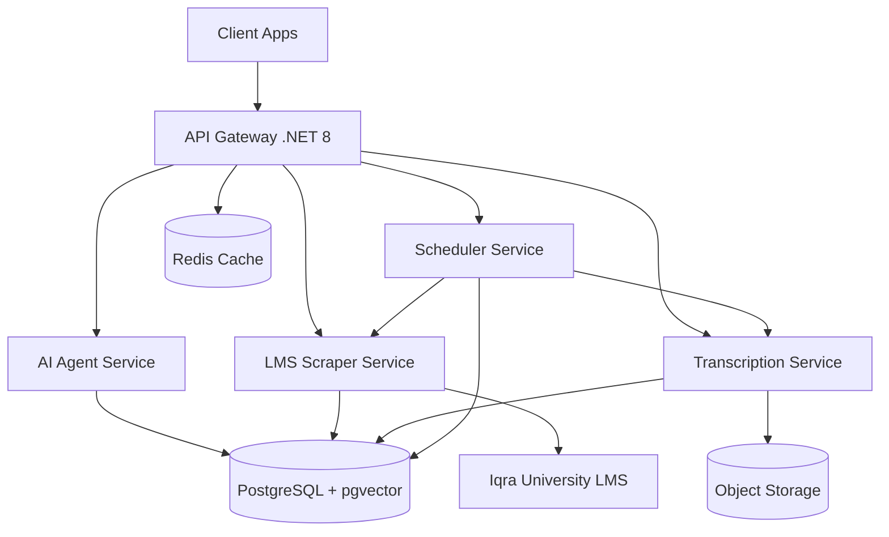

# Design Document: EduPilot Full-Stack System

## Overview

EduPilot is a comprehensive AI-powered university assistant system built as a monorepo containing multiple client applications and backend microservices. The system architecture follows a distributed microservices pattern with a .NET 8 API Gateway implementing Clean Architecture, four specialized Python microservices, and a PostgreSQL database with pgvector extension for semantic search capabilities.

### System Architecture

The system consists of three primary layers:

1. **Client Layer**: Four Next.js/React-based applications (Student Web App, Desktop App via Electron, Mobile App via React Native, Marketing Site)
2. **API Layer**: .NET 8 Web API Gateway with Clean Architecture implementing CQRS and Mediator patterns
3. **Service Layer**: Four Python microservices (AI Agent, LMS Scraper, Transcription, Scheduler) communicating via HTTP/REST and message queues
4. **Data Layer**: PostgreSQL with pgvector extension, Redis for caching, and object storage for media files

### Technology Stack

**Frontend:**
- Next.js 14 with App Router for web applications
- Electron for desktop application
- React Native with Expo for mobile applications
- TypeScript for type safety
- TanStack Query for data fetching and caching
- Zustand for state management

**Backend:**
- .NET 8 Web API with Clean Architecture
- Entity Framework Core 8 for ORM
- MediatR for CQRS implementation
- FluentValidation for input validation
- Serilog for structured logging

**Python Microservices:**
- FastAPI for REST APIs
- LangChain for AI agent orchestration
- Playwright for web scraping
- OpenAI Whisper for transcription
- APScheduler for job scheduling
- Pydantic for data validation

**Data & Infrastructure:**
- PostgreSQL 16 with pgvector extension
- Redis for caching and session management
- Docker and Docker Compose for containerization
- nginx as reverse proxy
- GitHub Actions for CI/CD


## Architecture

### Monorepo Structure

```
edupilot/
├── apps/
│   ├── web/                    # Student Web App (Next.js)
│   ├── desktop/                # Desktop App (Electron + Next.js)
│   ├── mobile/                 # Mobile App (React Native + Expo)
│   └── marketing/              # Marketing Site (Next.js)
├── services/
│   ├── api-gateway/            # .NET 8 Web API
│   ├── ai-agent/               # Python FastAPI + LangChain
│   ├── lms-scraper/            # Python FastAPI + Playwright
│   ├── transcription/          # Python FastAPI + Whisper
│   └── scheduler/              # Python FastAPI + APScheduler
├── packages/
│   ├── ui/                     # Shared React components
│   ├── types/                  # Shared TypeScript types
│   └── utils/                  # Shared utilities
├── infrastructure/
│   ├── docker/                 # Docker configurations
│   ├── nginx/                  # nginx configurations
│   └── k8s/                    # Kubernetes manifests (optional)
└── docker-compose.yml
```

### Clean Architecture in API Gateway

The .NET 8 API Gateway follows Clean Architecture with four layers:

**Domain Layer (Core):**
- Entities: Student, Course, Assignment, LectureRecording, Transcription, Announcement
- Value Objects: Email, StudentId, CourseCode, Grade
- Domain Events: StudentAuthenticated, DataSynced, TranscriptionCompleted
- Interfaces: IStudentRepository, IAuthenticationService, IVectorSearchService

**Application Layer:**
- Use Cases (Commands/Queries via MediatR):
  - Commands: AuthenticateStudent, SyncStudentData, ProcessQuery
  - Queries: GetStudentCourses, GetAssignments, SearchTranscriptions
- DTOs: StudentDto, CourseDto, QueryRequestDto, QueryResponseDto
- Validators: FluentValidation rules for all commands and queries
- Interfaces: IEmailService, INotificationService

**Infrastructure Layer:**
- Persistence: EF Core DbContext, Repository implementations
- External Services: HTTP clients for Python microservices
- Authentication: JWT token generation and validation
- Caching: Redis implementation
- Logging: Serilog configuration

**Presentation Layer (API):**
- Controllers: AuthController, StudentController, QueryController
- Middleware: Exception handling, authentication, rate limiting
- Filters: Validation filters, authorization filters
- API versioning and Swagger documentation

### Microservices Communication



**Communication Patterns:**
- Synchronous: HTTP/REST for client-to-gateway and gateway-to-microservices
- Asynchronous: Message queue (Redis Streams or RabbitMQ) for background jobs
- Event-driven: Domain events for cross-service notifications


## Components and Interfaces

### API Gateway (.NET 8)

**Authentication Module:**
```csharp
public interface IAuthenticationService
{
    Task<AuthenticationResult> AuthenticateAsync(string email, string password);
    Task<bool> ValidateTokenAsync(string token);
    Task<RefreshTokenResult> RefreshTokenAsync(string refreshToken);
}

public class AuthenticationResult
{
    public string AccessToken { get; set; }
    public string RefreshToken { get; set; }
    public DateTime ExpiresAt { get; set; }
    public StudentDto Student { get; set; }
}
```

**Student Repository:**
```csharp
public interface IStudentRepository
{
    Task<Student> GetByIdAsync(Guid studentId);
    Task<Student> GetByEmailAsync(string email);
    Task<IEnumerable<Course>> GetCoursesAsync(Guid studentId);
    Task<IEnumerable<Assignment>> GetAssignmentsAsync(Guid studentId);
    Task AddAsync(Student student);
    Task UpdateAsync(Student student);
}
```

**Query Processing:**
```csharp
public interface IQueryProcessor
{
    Task<QueryResponse> ProcessQueryAsync(QueryRequest request);
}

public class QueryRequest
{
    public Guid StudentId { get; set; }
    public string Query { get; set; }
    public QueryType Type { get; set; } // Text or Voice
    public byte[] AudioData { get; set; } // For voice queries
}

public class QueryResponse
{
    public string Answer { get; set; }
    public List<SourceCitation> Sources { get; set; }
    public float ConfidenceScore { get; set; }
}
```

### AI Agent Service (Python + LangChain)

**Service Interface:**
```python
from fastapi import FastAPI, HTTPException
from pydantic import BaseModel
from langchain.chains import RetrievalQA
from langchain.embeddings import OpenAIEmbeddings
from langchain.vectorstores.pgvector import PGVector

class QueryRequest(BaseModel):
    student_id: str
    query: str
    query_type: str  # "text" or "voice"
    audio_data: Optional[bytes] = None

class QueryResponse(BaseModel):
    answer: str
    sources: List[SourceCitation]
    confidence_score: float

class AIAgentService:
    def __init__(self):
        self.embeddings = OpenAIEmbeddings()
        self.vector_store = PGVector(
            connection_string=DATABASE_URL,
            embedding_function=self.embeddings
        )
        self.qa_chain = self._create_qa_chain()
    
    async def process_query(self, request: QueryRequest) -> QueryResponse:
        # Retrieve relevant context from vector store
        docs = await self.vector_store.similarity_search(
            request.query,
            k=5,
            filter={"student_id": request.student_id}
        )
        
        # Generate response using RAG
        response = await self.qa_chain.arun(
            query=request.query,
            context=docs
        )
        
        return QueryResponse(
            answer=response["answer"],
            sources=self._extract_sources(docs),
            confidence_score=response["confidence"]
        )
```

### LMS Scraper Service (Python + Playwright)

**Scraper Interface:**
```python
from playwright.async_api import async_playwright
from pydantic import BaseModel

class StudentCredentials(BaseModel):
    student_id: str
    email: str
    password: str

class ScrapedData(BaseModel):
    courses: List[Course]
    assignments: List[Assignment]
    grades: List[Grade]
    announcements: List[Announcement]
    schedule: List[ScheduleEntry]

class LMSScraperService:
    async def scrape_student_data(
        self, 
        credentials: StudentCredentials
    ) -> ScrapedData:
        async with async_playwright() as p:
            browser = await p.chromium.launch(headless=True)
            page = await browser.new_page()
            
            # Authenticate with LMS
            await self._authenticate(page, credentials)
            
            # Scrape data from different sections
            courses = await self._scrape_courses(page)
            assignments = await self._scrape_assignments(page)
            grades = await self._scrape_grades(page)
            announcements = await self._scrape_announcements(page)
            schedule = await self._scrape_schedule(page)
            
            await browser.close()
            
            return ScrapedData(
                courses=courses,
                assignments=assignments,
                grades=grades,
                announcements=announcements,
                schedule=schedule
            )
```

### Transcription Service (Python + Whisper)

**Transcription Interface:**
```python
import whisper
from pydantic import BaseModel

class TranscriptionRequest(BaseModel):
    recording_id: str
    audio_file_path: str
    course_id: str
    lecture_date: datetime

class TranscriptionResult(BaseModel):
    recording_id: str
    text: str
    segments: List[TranscriptionSegment]
    language: str
    duration: float

class TranscriptionSegment(BaseModel):
    start: float
    end: float
    text: str

class TranscriptionService:
    def __init__(self):
        self.model = whisper.load_model("base")
    
    async def transcribe(
        self, 
        request: TranscriptionRequest
    ) -> TranscriptionResult:
        # Load and transcribe audio
        result = self.model.transcribe(
            request.audio_file_path,
            language="en",
            task="transcribe"
        )
        
        # Create segments with timestamps
        segments = [
            TranscriptionSegment(
                start=seg["start"],
                end=seg["end"],
                text=seg["text"]
            )
            for seg in result["segments"]
        ]
        
        return TranscriptionResult(
            recording_id=request.recording_id,
            text=result["text"],
            segments=segments,
            language=result["language"],
            duration=result["duration"]
        )
```

### Scheduler Service (Python + APScheduler)

**Scheduler Interface:**
```python
from apscheduler.schedulers.asyncio import AsyncIOScheduler
from apscheduler.triggers.interval import IntervalTrigger
from pydantic import BaseModel

class JobConfig(BaseModel):
    job_id: str
    job_type: str  # "scraping", "transcription", "backup"
    schedule: str  # Cron expression or interval
    parameters: dict

class SchedulerService:
    def __init__(self):
        self.scheduler = AsyncIOScheduler()
        self.scheduler.start()
    
    async def schedule_scraping_job(self, student_id: str):
        self.scheduler.add_job(
            func=self._execute_scraping,
            trigger=IntervalTrigger(hours=6),
            args=[student_id],
            id=f"scraping_{student_id}",
            replace_existing=True
        )
    
    async def schedule_transcription_job(self, recording_id: str):
        self.scheduler.add_job(
            func=self._execute_transcription,
            trigger="date",
            run_date=datetime.now() + timedelta(minutes=5),
            args=[recording_id],
            id=f"transcription_{recording_id}"
        )
    
    async def _execute_scraping(self, student_id: str):
        # Call LMS Scraper Service
        async with httpx.AsyncClient() as client:
            response = await client.post(
                f"{LMS_SCRAPER_URL}/scrape",
                json={"student_id": student_id}
            )
```

### Client Applications

**Shared API Client (TypeScript):**
```typescript
export interface QueryRequest {
  query: string;
  type: 'text' | 'voice';
  audioData?: Blob;
}

export interface QueryResponse {
  answer: string;
  sources: SourceCitation[];
  confidenceScore: number;
}

export class EduPilotClient {
  private baseUrl: string;
  private token: string;

  async authenticate(email: string, password: string): Promise<AuthResult> {
    const response = await fetch(`${this.baseUrl}/auth/login`, {
      method: 'POST',
      headers: { 'Content-Type': 'application/json' },
      body: JSON.stringify({ email, password })
    });
    
    const data = await response.json();
    this.token = data.accessToken;
    return data;
  }

  async submitQuery(request: QueryRequest): Promise<QueryResponse> {
    const response = await fetch(`${this.baseUrl}/query`, {
      method: 'POST',
      headers: {
        'Content-Type': 'application/json',
        'Authorization': `Bearer ${this.token}`
      },
      body: JSON.stringify(request)
    });
    
    return await response.json();
  }

  async getCourses(): Promise<Course[]> {
    const response = await fetch(`${this.baseUrl}/student/courses`, {
      headers: { 'Authorization': `Bearer ${this.token}` }
    });
    
    return await response.json();
  }
}
```


## Data Models

### Domain Entities (.NET)

**Student Entity:**
```csharp
public class Student : BaseEntity
{
    public Guid Id { get; private set; }
    public Email Email { get; private set; }
    public string PasswordHash { get; private set; }
    public string FirstName { get; private set; }
    public string LastName { get; private set; }
    public StudentId UniversityId { get; private set; }
    public DateTime EnrolledAt { get; private set; }
    public bool IsActive { get; private set; }
    
    private readonly List<Course> _courses = new();
    public IReadOnlyCollection<Course> Courses => _courses.AsReadOnly();
    
    private readonly List<LectureRecording> _recordings = new();
    public IReadOnlyCollection<LectureRecording> Recordings => _recordings.AsReadOnly();
}

public class Course : BaseEntity
{
    public Guid Id { get; private set; }
    public CourseCode Code { get; private set; }
    public string Name { get; private set; }
    public string Instructor { get; private set; }
    public Semester Semester { get; private set; }
    public int CreditHours { get; private set; }
    
    private readonly List<Assignment> _assignments = new();
    public IReadOnlyCollection<Assignment> Assignments => _assignments.AsReadOnly();
}

public class Assignment : BaseEntity
{
    public Guid Id { get; private set; }
    public Guid CourseId { get; private set; }
    public string Title { get; private set; }
    public string Description { get; private set; }
    public DateTime DueDate { get; private set; }
    public int MaxPoints { get; private set; }
    public Grade? Grade { get; private set; }
    public AssignmentStatus Status { get; private set; }
}

public class LectureRecording : BaseEntity
{
    public Guid Id { get; private set; }
    public Guid CourseId { get; private set; }
    public string Title { get; private set; }
    public DateTime RecordedAt { get; private set; }
    public TimeSpan Duration { get; private set; }
    public string StorageUrl { get; private set; }
    public RecordingSource Source { get; private set; } // Zoom or GoogleMeet
    public Transcription? Transcription { get; private set; }
}

public class Transcription : BaseEntity
{
    public Guid Id { get; private set; }
    public Guid RecordingId { get; private set; }
    public string FullText { get; private set; }
    public string Language { get; private set; }
    public DateTime TranscribedAt { get; private set; }
    
    private readonly List<TranscriptionSegment> _segments = new();
    public IReadOnlyCollection<TranscriptionSegment> Segments => _segments.AsReadOnly();
}

public class TranscriptionSegment : BaseEntity
{
    public Guid Id { get; private set; }
    public Guid TranscriptionId { get; private set; }
    public TimeSpan StartTime { get; private set; }
    public TimeSpan EndTime { get; private set; }
    public string Text { get; private set; }
}
```

### Value Objects

```csharp
public class Email : ValueObject
{
    public string Value { get; private set; }
    
    private Email(string value)
    {
        Value = value;
    }
    
    public static Email Create(string email)
    {
        if (string.IsNullOrWhiteSpace(email))
            throw new ArgumentException("Email cannot be empty");
            
        if (!IsValidEmail(email))
            throw new ArgumentException("Invalid email format");
            
        return new Email(email.ToLowerInvariant());
    }
    
    protected override IEnumerable<object> GetEqualityComponents()
    {
        yield return Value;
    }
}

public class Grade : ValueObject
{
    public decimal Points { get; private set; }
    public decimal MaxPoints { get; private set; }
    public decimal Percentage => (Points / MaxPoints) * 100;
    public string LetterGrade => CalculateLetterGrade();
    
    private Grade(decimal points, decimal maxPoints)
    {
        if (points < 0 || maxPoints <= 0 || points > maxPoints)
            throw new ArgumentException("Invalid grade values");
            
        Points = points;
        MaxPoints = maxPoints;
    }
    
    public static Grade Create(decimal points, decimal maxPoints)
    {
        return new Grade(points, maxPoints);
    }
}
```

### Database Schema (PostgreSQL)

**Students Table:**
```sql
CREATE TABLE students (
    id UUID PRIMARY KEY DEFAULT gen_random_uuid(),
    email VARCHAR(255) UNIQUE NOT NULL,
    password_hash VARCHAR(255) NOT NULL,
    first_name VARCHAR(100) NOT NULL,
    last_name VARCHAR(100) NOT NULL,
    university_id VARCHAR(50) UNIQUE NOT NULL,
    enrolled_at TIMESTAMP NOT NULL,
    is_active BOOLEAN DEFAULT true,
    created_at TIMESTAMP DEFAULT CURRENT_TIMESTAMP,
    updated_at TIMESTAMP DEFAULT CURRENT_TIMESTAMP
);

CREATE INDEX idx_students_email ON students(email);
CREATE INDEX idx_students_university_id ON students(university_id);
```

**Courses Table:**
```sql
CREATE TABLE courses (
    id UUID PRIMARY KEY DEFAULT gen_random_uuid(),
    code VARCHAR(20) NOT NULL,
    name VARCHAR(255) NOT NULL,
    instructor VARCHAR(255),
    semester VARCHAR(50) NOT NULL,
    credit_hours INTEGER NOT NULL,
    created_at TIMESTAMP DEFAULT CURRENT_TIMESTAMP,
    updated_at TIMESTAMP DEFAULT CURRENT_TIMESTAMP
);

CREATE TABLE student_courses (
    student_id UUID REFERENCES students(id) ON DELETE CASCADE,
    course_id UUID REFERENCES courses(id) ON DELETE CASCADE,
    enrolled_at TIMESTAMP DEFAULT CURRENT_TIMESTAMP,
    PRIMARY KEY (student_id, course_id)
);

CREATE INDEX idx_student_courses_student ON student_courses(student_id);
```

**Assignments Table:**
```sql
CREATE TABLE assignments (
    id UUID PRIMARY KEY DEFAULT gen_random_uuid(),
    course_id UUID REFERENCES courses(id) ON DELETE CASCADE,
    title VARCHAR(255) NOT NULL,
    description TEXT,
    due_date TIMESTAMP NOT NULL,
    max_points INTEGER NOT NULL,
    status VARCHAR(50) NOT NULL,
    created_at TIMESTAMP DEFAULT CURRENT_TIMESTAMP,
    updated_at TIMESTAMP DEFAULT CURRENT_TIMESTAMP
);

CREATE TABLE student_assignments (
    student_id UUID REFERENCES students(id) ON DELETE CASCADE,
    assignment_id UUID REFERENCES assignments(id) ON DELETE CASCADE,
    points_earned DECIMAL(5,2),
    submitted_at TIMESTAMP,
    graded_at TIMESTAMP,
    PRIMARY KEY (student_id, assignment_id)
);

CREATE INDEX idx_assignments_course ON assignments(course_id);
CREATE INDEX idx_assignments_due_date ON assignments(due_date);
```

**Lecture Recordings Table:**
```sql
CREATE TABLE lecture_recordings (
    id UUID PRIMARY KEY DEFAULT gen_random_uuid(),
    course_id UUID REFERENCES courses(id) ON DELETE CASCADE,
    title VARCHAR(255) NOT NULL,
    recorded_at TIMESTAMP NOT NULL,
    duration_seconds INTEGER NOT NULL,
    storage_url TEXT NOT NULL,
    source VARCHAR(50) NOT NULL, -- 'Zoom' or 'GoogleMeet'
    created_at TIMESTAMP DEFAULT CURRENT_TIMESTAMP
);

CREATE INDEX idx_recordings_course ON lecture_recordings(course_id);
CREATE INDEX idx_recordings_date ON lecture_recordings(recorded_at);
```

**Transcriptions Table:**
```sql
CREATE TABLE transcriptions (
    id UUID PRIMARY KEY DEFAULT gen_random_uuid(),
    recording_id UUID REFERENCES lecture_recordings(id) ON DELETE CASCADE,
    full_text TEXT NOT NULL,
    language VARCHAR(10) NOT NULL,
    transcribed_at TIMESTAMP DEFAULT CURRENT_TIMESTAMP
);

CREATE TABLE transcription_segments (
    id UUID PRIMARY KEY DEFAULT gen_random_uuid(),
    transcription_id UUID REFERENCES transcriptions(id) ON DELETE CASCADE,
    start_time_seconds DECIMAL(10,2) NOT NULL,
    end_time_seconds DECIMAL(10,2) NOT NULL,
    text TEXT NOT NULL
);

CREATE INDEX idx_transcriptions_recording ON transcriptions(recording_id);
```

**Vector Embeddings Table (pgvector):**
```sql
-- Enable pgvector extension
CREATE EXTENSION IF NOT EXISTS vector;

CREATE TABLE document_embeddings (
    id UUID PRIMARY KEY DEFAULT gen_random_uuid(),
    student_id UUID REFERENCES students(id) ON DELETE CASCADE,
    document_type VARCHAR(50) NOT NULL, -- 'course', 'assignment', 'transcription', 'announcement'
    document_id UUID NOT NULL,
    content TEXT NOT NULL,
    embedding vector(1536), -- OpenAI embedding dimension
    metadata JSONB,
    created_at TIMESTAMP DEFAULT CURRENT_TIMESTAMP
);

-- Create index for vector similarity search
CREATE INDEX idx_embeddings_vector ON document_embeddings 
USING ivfflat (embedding vector_cosine_ops)
WITH (lists = 100);

CREATE INDEX idx_embeddings_student ON document_embeddings(student_id);
CREATE INDEX idx_embeddings_type ON document_embeddings(document_type);
```

**Announcements Table:**
```sql
CREATE TABLE announcements (
    id UUID PRIMARY KEY DEFAULT gen_random_uuid(),
    course_id UUID REFERENCES courses(id) ON DELETE CASCADE,
    title VARCHAR(255) NOT NULL,
    content TEXT NOT NULL,
    posted_at TIMESTAMP NOT NULL,
    priority VARCHAR(20) DEFAULT 'normal', -- 'low', 'normal', 'high', 'urgent'
    created_at TIMESTAMP DEFAULT CURRENT_TIMESTAMP
);

CREATE INDEX idx_announcements_course ON announcements(course_id);
CREATE INDEX idx_announcements_posted ON announcements(posted_at DESC);
```

### DTOs and API Models

**Authentication DTOs:**
```csharp
public record LoginRequest(string Email, string Password);

public record LoginResponse(
    string AccessToken,
    string RefreshToken,
    DateTime ExpiresAt,
    StudentDto Student
);

public record StudentDto(
    Guid Id,
    string Email,
    string FirstName,
    string LastName,
    string UniversityId
);
```

**Query DTOs:**
```csharp
public record QueryRequestDto(
    string Query,
    QueryType Type,
    byte[]? AudioData = null
);

public record QueryResponseDto(
    string Answer,
    List<SourceCitationDto> Sources,
    float ConfidenceScore
);

public record SourceCitationDto(
    string DocumentType,
    string Title,
    string Excerpt,
    string? Url
);
```


## Correctness Properties

*A property is a characteristic or behavior that should hold true across all valid executions of a system-essentially, a formal statement about what the system should do. Properties serve as the bridge between human-readable specifications and machine-verifiable correctness guarantees.*

### Property 1: Authentication Round Trip

*For any* valid student credentials (email and password), authenticating with the API Gateway should return an authentication token, and that token should be valid for accessing protected endpoints until it expires.

**Validates: Requirements 1.1, 1.3, 1.4**

### Property 2: Invalid Credentials Rejection

*For any* invalid credentials (wrong password, non-existent email, or malformed input), the API Gateway should reject the authentication attempt and return an error within 2 seconds.

**Validates: Requirements 1.2**

### Property 3: LMS Scraping Pipeline Completeness

*For any* active student with valid LMS credentials, when a scraping job executes, the system should authenticate with the LMS, extract all data types (courses, grades, assignments, schedules, announcements), and store the data in the vector database with generated embeddings.

**Validates: Requirements 2.1, 2.2, 2.3**

### Property 4: Retry with Exponential Backoff

*For any* external service call (LMS, recording download, transcription) that fails, the system should retry up to 3 times with exponentially increasing delays before logging a final failure.

**Validates: Requirements 2.4, 3.5, 13.4**

### Property 5: Scraping Job Scheduling

*For any* active student, the scheduler service should trigger scraping jobs at 6-hour intervals consistently.

**Validates: Requirements 2.6, 13.1**

### Property 6: Recording Storage with Metadata

*For any* downloaded lecture recording, the system should store the recording with complete metadata including course ID, recording date, duration, and source platform (Zoom or Google Meet).

**Validates: Requirements 3.4**

### Property 7: Transcription Pipeline

*For any* newly stored lecture recording, the system should queue it for transcription within 5 minutes, process it using Whisper, store the transcription with timestamps, and generate vector embeddings for semantic search.

**Validates: Requirements 4.1, 4.2, 4.3, 4.4, 13.2**

### Property 8: Audio Quality Threshold

*For any* audio file with sample rate below 16kHz, the transcription service should reject the file and not attempt transcription.

**Validates: Requirements 4.6**

### Property 9: Query Processing Pipeline

*For any* student query (text or voice), the AI agent service should retrieve relevant context from the vector database using semantic search, generate a response using RAG with the retrieved context, include source citations, and return the response within 5 seconds.

**Validates: Requirements 5.1, 5.2, 5.3, 5.4, 5.5, 5.6**

### Property 10: Embedding Model Consistency

*For any* student data being stored and any query being processed, the system should use the same embedding model for generating vector embeddings to ensure semantic search accuracy.

**Validates: Requirements 6.1**

### Property 11: Vector Search Result Count

*For any* query processed by the AI agent, the vector database should return exactly 5 most semantically similar documents (or fewer if less than 5 documents exist for that student).

**Validates: Requirements 6.2**

### Property 12: Low Confidence Indication

*For any* query where all retrieved documents have similarity scores below 0.7, the AI agent should indicate low confidence in the response.

**Validates: Requirements 6.5**

### Property 13: Response Display Completeness

*For any* query submitted through the web app, the displayed response should include both the answer text and source citations.

**Validates: Requirements 7.3**

### Property 14: Student Data Display

*For any* authenticated student viewing the web app dashboard, the system should display their courses, assignments, and upcoming deadlines.

**Validates: Requirements 7.4**

### Property 15: Feature Parity Across Clients

*For any* core feature available in the Student Web App (query submission, course viewing, assignment viewing, recording access), the same feature should be available in the Desktop App and Mobile App.

**Validates: Requirements 8.1, 9.1**

### Property 16: Offline Data Caching

*For any* student data accessed while online in the Desktop App, that data should be cached and accessible when the app goes offline.

**Validates: Requirements 8.2**

### Property 17: Offline Query Queuing

*For any* query submitted while the Desktop App is offline, the query should be queued and automatically processed when connectivity is restored.

**Validates: Requirements 8.3**

### Property 18: Push Notification Delivery

*For any* assignment with a deadline within 24 hours or any new announcement, the mobile app should send a push notification to the student.

**Validates: Requirements 9.2**

### Property 19: Request Routing

*For any* incoming request to the API Gateway, the request should be routed to the appropriate microservice based on the endpoint path.

**Validates: Requirements 11.2**

### Property 20: Rate Limiting

*For any* student making requests to the API Gateway, the system should allow up to 100 requests per minute and reject additional requests with a rate limit error.

**Validates: Requirements 11.3**

### Property 21: Request Logging Completeness

*For any* request processed by the API Gateway, the system should log the request with timestamp, user ID, endpoint, and response time.

**Validates: Requirements 11.4**

### Property 22: Microservice Timeout

*For any* microservice that becomes unavailable, the API Gateway should timeout after 10 seconds and return a service unavailable error.

**Validates: Requirements 11.5**

### Property 23: Vector Similarity Search

*For any* query vector, the database should return documents ranked by cosine similarity distance.

**Validates: Requirements 12.2**

### Property 24: Database Backup Scheduling

*For any* 24-hour period, the system should execute exactly one automated database backup.

**Validates: Requirements 12.4**

### Property 25: Query Performance

*For any* 100 consecutive vector search queries, at least 95 of them should return results within 500 milliseconds.

**Validates: Requirements 12.5**

### Property 26: Job Failure Alerting

*For any* scheduled job that fails after all retry attempts, the scheduler should send an alert to system administrators.

**Validates: Requirements 13.5**

### Property 27: Job History Retention

*For any* job execution record, the system should retain the record for 90 days before deletion.

**Validates: Requirements 13.6**

### Property 28: Error Logging with Context

*For any* error occurring in any service, the system should log the error with stack trace, timestamp, service name, and relevant context data.

**Validates: Requirements 2.5, 4.5, 15.1**

### Property 29: Metrics Collection

*For any* request processed by the system, metrics for response time, error status, and resource usage should be collected and stored.

**Validates: Requirements 15.2**

### Property 30: Error Rate Alerting

*For any* 1-minute window where error rate exceeds 5% of total requests, the system should send an alert.

**Validates: Requirements 15.3**

### Property 31: Response Time Alerting

*For any* API request that takes longer than 10 seconds, the system should send an alert.

**Validates: Requirements 15.4**

### Property 32: Log Retention

*For any* log entry, the system should retain it for 30 days before deletion.

**Validates: Requirements 15.6**

### Property 33: Input Validation and Sanitization

*For any* user input containing SQL injection patterns, XSS payloads, or other malicious content, the API Gateway should reject the input and return a validation error.

**Validates: Requirements 16.3**

### Property 34: Role-Based Access Control

*For any* administrative endpoint, the system should verify the user has the required role before allowing access, and reject requests from users without the role.

**Validates: Requirements 16.4**

### Property 35: Security Attempt Logging

*For any* detected security vulnerability attempt (injection attack, unauthorized access), the system should log the attempt with details and block the request.

**Validates: Requirements 16.5**

### Property 36: User-Friendly Error Messages

*For any* error occurring in the system, the response returned to the client should contain a user-friendly message without exposing internal implementation details.

**Validates: Requirements 17.1**

### Property 37: Service Fault Isolation

*For any* microservice failure, the API Gateway should continue serving requests to other healthy services without cascading failures.

**Validates: Requirements 17.2**

### Property 38: Fallback to Cache

*For any* external service (Vector Database, LMS) that becomes unavailable, the system should attempt to serve requests using cached data when available.

**Validates: Requirements 17.3, 17.4**

### Property 39: Circuit Breaker Behavior

*For any* external service that fails 5 consecutive times, the system should open a circuit breaker to stop sending requests, then attempt recovery after 60 seconds.

**Validates: Requirements 17.5, 17.6**

### Property 40: Concurrent Request Handling

*For any* load test sending 1000 concurrent requests to the API Gateway, the system should successfully process all requests without errors.

**Validates: Requirements 18.1**

### Property 41: AI Agent Response Time

*For any* 100 consecutive queries processed by the AI agent, the average response time should be under 3 seconds.

**Validates: Requirements 18.3**

### Property 42: Vector Search Throughput

*For any* 1-minute period, the vector database should successfully process at least 10,000 search queries.

**Validates: Requirements 18.4**

### Property 43: Data Synchronization Timing

*For any* student data update, the change should propagate to all active client sessions within 30 seconds.

**Validates: Requirements 19.1**

### Property 44: Conflict Resolution Strategy

*For any* data conflict between two updates, the system should resolve it using last-write-wins based on timestamp comparison.

**Validates: Requirements 19.2**

### Property 45: Cross-Device Synchronization

*For any* data update made on one device, the change should sync to all other devices logged in with the same student account.

**Validates: Requirements 19.3**

### Property 46: Cache Consistency

*For any* data stored in the vector database, the cached version in Redis should match the database version or be invalidated.

**Validates: Requirements 19.4**

### Property 47: Sync Failure Retry Queue

*For any* synchronization operation that fails, the system should queue the change for retry rather than dropping it.

**Validates: Requirements 19.5**

### Property 48: Keyboard Navigation

*For any* interactive element in the web app, the element should be accessible and operable using only keyboard navigation.

**Validates: Requirements 20.1**

### Property 49: ARIA Label Presence

*For any* interactive element in the web app, the element should have appropriate ARIA labels for screen reader compatibility.

**Validates: Requirements 20.2**

### Property 50: Text Scaling Support

*For any* text content in the web app, scaling the text up to 200% should not cause loss of functionality or content overlap.

**Validates: Requirements 20.3**

### Property 51: Color Contrast Compliance

*For any* normal text in the web app, the color contrast ratio between text and background should be at least 4.5:1.

**Validates: Requirements 20.4**


## Error Handling

### Error Handling Strategy

The system implements a comprehensive error handling strategy across all layers:

**API Gateway Error Handling:**
- Global exception middleware catches all unhandled exceptions
- Custom exception types for domain errors (ValidationException, NotFoundException, UnauthorizedException)
- Structured error responses with correlation IDs for tracing
- Different error responses for development vs production (hide stack traces in production)

**Error Response Format:**
```csharp
public class ErrorResponse
{
    public string CorrelationId { get; set; }
    public string Message { get; set; }
    public int StatusCode { get; set; }
    public Dictionary<string, string[]> Errors { get; set; } // For validation errors
    public DateTime Timestamp { get; set; }
}
```

**Microservices Error Handling:**
- FastAPI exception handlers for common error types
- Retry logic with exponential backoff for transient failures
- Circuit breakers for external service calls
- Graceful degradation using cached data when services are unavailable

**Error Categories:**

1. **Validation Errors (400 Bad Request)**
   - Invalid input format
   - Missing required fields
   - Business rule violations
   - Example: Empty query string, invalid email format

2. **Authentication Errors (401 Unauthorized)**
   - Invalid credentials
   - Expired tokens
   - Missing authentication header
   - Example: Expired JWT token

3. **Authorization Errors (403 Forbidden)**
   - Insufficient permissions
   - Role-based access denial
   - Example: Non-admin accessing admin endpoints

4. **Not Found Errors (404 Not Found)**
   - Resource doesn't exist
   - Student not found
   - Course not found
   - Example: Querying non-existent assignment

5. **Rate Limit Errors (429 Too Many Requests)**
   - Exceeded rate limit
   - Includes retry-after header
   - Example: More than 100 requests per minute

6. **Service Errors (500 Internal Server Error)**
   - Unhandled exceptions
   - Database connection failures
   - External service failures
   - Example: Database timeout

7. **Service Unavailable (503 Service Unavailable)**
   - Microservice down
   - Circuit breaker open
   - Maintenance mode
   - Example: AI agent service unreachable

### Retry and Resilience Patterns

**Exponential Backoff Configuration:**
```python
class RetryConfig:
    max_attempts: int = 3
    initial_delay: float = 1.0  # seconds
    max_delay: float = 60.0
    exponential_base: float = 2.0
    jitter: bool = True

async def retry_with_backoff(func, config: RetryConfig):
    for attempt in range(config.max_attempts):
        try:
            return await func()
        except Exception as e:
            if attempt == config.max_attempts - 1:
                raise
            
            delay = min(
                config.initial_delay * (config.exponential_base ** attempt),
                config.max_delay
            )
            
            if config.jitter:
                delay *= (0.5 + random.random() * 0.5)
            
            await asyncio.sleep(delay)
```

**Circuit Breaker Implementation:**
```csharp
public class CircuitBreakerConfig
{
    public int FailureThreshold { get; set; } = 5;
    public TimeSpan OpenDuration { get; set; } = TimeSpan.FromSeconds(60);
    public TimeSpan Timeout { get; set; } = TimeSpan.FromSeconds(10);
}

public class CircuitBreaker
{
    private CircuitState _state = CircuitState.Closed;
    private int _failureCount = 0;
    private DateTime _lastFailureTime;
    
    public async Task<T> ExecuteAsync<T>(Func<Task<T>> action)
    {
        if (_state == CircuitState.Open)
        {
            if (DateTime.UtcNow - _lastFailureTime > _config.OpenDuration)
            {
                _state = CircuitState.HalfOpen;
            }
            else
            {
                throw new CircuitBreakerOpenException();
            }
        }
        
        try
        {
            var result = await action().TimeoutAfter(_config.Timeout);
            
            if (_state == CircuitState.HalfOpen)
            {
                _state = CircuitState.Closed;
                _failureCount = 0;
            }
            
            return result;
        }
        catch (Exception)
        {
            _failureCount++;
            _lastFailureTime = DateTime.UtcNow;
            
            if (_failureCount >= _config.FailureThreshold)
            {
                _state = CircuitState.Open;
            }
            
            throw;
        }
    }
}
```

### Fallback Strategies

**Cache Fallback:**
- When vector database is unavailable, serve cached query responses
- Cache TTL: 1 hour for query responses, 6 hours for student data
- Cache invalidation on data updates

**Graceful Degradation:**
- If AI agent is down, return cached responses with disclaimer
- If LMS scraper fails, use last successful scrape data
- If transcription service is unavailable, queue recordings for later processing

### Logging and Monitoring

**Structured Logging with Serilog:**
```csharp
Log.Information(
    "Query processed for student {StudentId} with confidence {Confidence}",
    studentId,
    confidenceScore
);

Log.Error(
    exception,
    "Failed to scrape LMS data for student {StudentId} after {Attempts} attempts",
    studentId,
    attemptCount
);
```

**Log Levels:**
- **Trace**: Detailed diagnostic information
- **Debug**: Internal system events for debugging
- **Information**: General informational messages
- **Warning**: Unexpected but handled situations
- **Error**: Errors and exceptions
- **Fatal**: Critical failures requiring immediate attention

**Correlation IDs:**
- Every request gets a unique correlation ID
- Correlation ID propagates across all microservices
- Enables end-to-end request tracing


## Testing Strategy

### Dual Testing Approach

The EduPilot system employs both unit testing and property-based testing to ensure comprehensive coverage:

**Unit Tests:**
- Verify specific examples and edge cases
- Test integration points between components
- Validate error conditions and boundary cases
- Focus on concrete scenarios with known inputs and outputs

**Property-Based Tests:**
- Verify universal properties across all inputs
- Use randomized input generation for comprehensive coverage
- Test invariants that should hold for any valid input
- Minimum 100 iterations per property test

Both approaches are complementary and necessary: unit tests catch specific bugs and validate concrete behavior, while property tests verify general correctness across the input space.

### Testing Frameworks

**Backend (.NET):**
- **xUnit**: Primary testing framework
- **FluentAssertions**: Readable assertions
- **Moq**: Mocking framework
- **FsCheck**: Property-based testing library for .NET
- **Testcontainers**: Docker containers for integration tests

**Python Microservices:**
- **pytest**: Primary testing framework
- **Hypothesis**: Property-based testing library for Python
- **pytest-asyncio**: Async test support
- **pytest-mock**: Mocking support
- **httpx**: HTTP client for testing FastAPI endpoints

**Frontend:**
- **Vitest**: Fast unit test runner
- **React Testing Library**: Component testing
- **Playwright**: End-to-end testing
- **fast-check**: Property-based testing for TypeScript

### Property-Based Testing Configuration

Each property test must:
1. Run minimum 100 iterations (configured in test setup)
2. Reference the design document property in a comment tag
3. Use appropriate generators for input data
4. Verify the property holds for all generated inputs

**Tag Format:**
```csharp
// Feature: edupilot-full-stack-system, Property 1: Authentication Round Trip
[Property(Arbitrary = new[] { typeof(StudentCredentialsGenerator) })]
public Property AuthenticationRoundTrip(StudentCredentials credentials)
{
    // Test implementation
}
```

**Example Property Test (.NET with FsCheck):**
```csharp
// Feature: edupilot-full-stack-system, Property 1: Authentication Round Trip
public class AuthenticationTests
{
    [Property(MaxTest = 100)]
    public Property ValidCredentialsShouldAuthenticateSuccessfully()
    {
        return Prop.ForAll(
            ValidStudentCredentialsGenerator(),
            async credentials =>
            {
                // Arrange
                var authService = CreateAuthService();
                
                // Act
                var authResult = await authService.AuthenticateAsync(
                    credentials.Email,
                    credentials.Password
                );
                
                // Assert
                Assert.NotNull(authResult.AccessToken);
                
                var isValid = await authService.ValidateTokenAsync(
                    authResult.AccessToken
                );
                
                Assert.True(isValid);
            }
        );
    }
    
    private static Arbitrary<StudentCredentials> ValidStudentCredentialsGenerator()
    {
        return Arb.From(
            from email in Arb.Generate<NonEmptyString>()
                .Select(s => $"{s.Get}@iqra.edu.pk")
            from password in Arb.Generate<NonEmptyString>()
                .Where(s => s.Get.Length >= 8)
            select new StudentCredentials(email, password.Get)
        );
    }
}
```

**Example Property Test (Python with Hypothesis):**
```python
# Feature: edupilot-full-stack-system, Property 9: Query Processing Pipeline
from hypothesis import given, settings, strategies as st

@given(
    student_id=st.uuids(),
    query=st.text(min_size=1, max_size=500)
)
@settings(max_examples=100)
async def test_query_processing_pipeline(student_id, query):
    """
    For any student query, the AI agent should retrieve context,
    generate a response with citations, and return within 5 seconds.
    """
    # Arrange
    ai_agent = AIAgentService()
    start_time = time.time()
    
    # Act
    response = await ai_agent.process_query(
        QueryRequest(student_id=str(student_id), query=query)
    )
    
    elapsed_time = time.time() - start_time
    
    # Assert
    assert response.answer is not None
    assert len(response.sources) > 0
    assert 0.0 <= response.confidence_score <= 1.0
    assert elapsed_time < 5.0
```

**Example Property Test (TypeScript with fast-check):**
```typescript
// Feature: edupilot-full-stack-system, Property 20: Rate Limiting
import fc from 'fast-check';

describe('Rate Limiting', () => {
  it('should limit requests to 100 per minute per student', async () => {
    await fc.assert(
      fc.asyncProperty(
        fc.uuid(), // student ID
        fc.array(fc.anything(), { minLength: 101, maxLength: 150 }), // requests
        async (studentId, requests) => {
          const client = new EduPilotClient();
          await client.authenticate('test@iqra.edu.pk', 'password');
          
          let successCount = 0;
          let rateLimitCount = 0;
          
          for (const request of requests) {
            try {
              await client.submitQuery({ query: 'test', type: 'text' });
              successCount++;
            } catch (error) {
              if (error.status === 429) {
                rateLimitCount++;
              }
            }
          }
          
          // Should allow up to 100 requests
          expect(successCount).toBeLessThanOrEqual(100);
          // Should rate limit additional requests
          expect(rateLimitCount).toBeGreaterThan(0);
        }
      ),
      { numRuns: 100 }
    );
  });
});
```

### Unit Testing Strategy

**API Gateway Unit Tests:**
- Controller tests: Verify request/response handling
- Use case tests: Test business logic in isolation
- Repository tests: Verify data access patterns
- Validator tests: Test input validation rules
- Middleware tests: Test authentication, logging, error handling

**Microservice Unit Tests:**
- Endpoint tests: Verify API contract
- Service layer tests: Test business logic
- Integration tests: Test with real database using Testcontainers
- Mock external dependencies (LMS, OpenAI API)

**Frontend Unit Tests:**
- Component tests: Verify rendering and user interactions
- Hook tests: Test custom React hooks
- API client tests: Verify request formatting
- State management tests: Test Zustand stores

### Integration Testing

**API Integration Tests:**
```csharp
public class StudentQueryIntegrationTests : IClassFixture<WebApplicationFactory<Program>>
{
    private readonly HttpClient _client;
    
    [Fact]
    public async Task SubmitQuery_WithValidToken_ReturnsResponse()
    {
        // Arrange
        var token = await AuthenticateTestUser();
        _client.DefaultRequestHeaders.Authorization = 
            new AuthenticationHeaderValue("Bearer", token);
        
        var request = new QueryRequestDto("What are my upcoming assignments?", QueryType.Text);
        
        // Act
        var response = await _client.PostAsJsonAsync("/api/query", request);
        
        // Assert
        response.EnsureSuccessStatusCode();
        var result = await response.Content.ReadFromJsonAsync<QueryResponseDto>();
        Assert.NotNull(result.Answer);
        Assert.NotEmpty(result.Sources);
    }
}
```

**Database Integration Tests:**
```python
@pytest.mark.asyncio
async def test_vector_search_returns_similar_documents():
    """Test vector similarity search with real database."""
    async with TestDatabase() as db:
        # Arrange
        student_id = uuid.uuid4()
        await seed_test_data(db, student_id)
        
        # Act
        results = await db.similarity_search(
            student_id=student_id,
            query_vector=generate_test_embedding("machine learning"),
            k=5
        )
        
        # Assert
        assert len(results) == 5
        assert all(r.similarity_score >= 0.0 for r in results)
        assert results[0].similarity_score >= results[-1].similarity_score
```

### End-to-End Testing

**Playwright E2E Tests:**
```typescript
test('student can submit query and view response', async ({ page }) => {
  // Login
  await page.goto('/login');
  await page.fill('[name="email"]', 'test@iqra.edu.pk');
  await page.fill('[name="password"]', 'password123');
  await page.click('button[type="submit"]');
  
  // Submit query
  await page.waitForSelector('[data-testid="query-input"]');
  await page.fill('[data-testid="query-input"]', 'What are my courses?');
  await page.click('[data-testid="submit-query"]');
  
  // Verify response
  await page.waitForSelector('[data-testid="query-response"]');
  const response = await page.textContent('[data-testid="query-response"]');
  expect(response).toBeTruthy();
  
  // Verify citations
  const citations = await page.locator('[data-testid="source-citation"]').count();
  expect(citations).toBeGreaterThan(0);
});
```

### Performance Testing

**Load Testing with k6:**
```javascript
import http from 'k6/http';
import { check, sleep } from 'k6';

export const options = {
  stages: [
    { duration: '2m', target: 100 },  // Ramp up to 100 users
    { duration: '5m', target: 100 },  // Stay at 100 users
    { duration: '2m', target: 1000 }, // Ramp up to 1000 users
    { duration: '5m', target: 1000 }, // Stay at 1000 users
    { duration: '2m', target: 0 },    // Ramp down
  ],
  thresholds: {
    http_req_duration: ['p(95)<3000'], // 95% of requests under 3s
    http_req_failed: ['rate<0.05'],    // Error rate under 5%
  },
};

export default function () {
  const token = login();
  
  const response = http.post(
    'https://api.edupilot.com/query',
    JSON.stringify({
      query: 'What are my upcoming assignments?',
      type: 'text'
    }),
    {
      headers: {
        'Authorization': `Bearer ${token}`,
        'Content-Type': 'application/json',
      },
    }
  );
  
  check(response, {
    'status is 200': (r) => r.status === 200,
    'response time < 5s': (r) => r.timings.duration < 5000,
    'has answer': (r) => JSON.parse(r.body).answer !== null,
  });
  
  sleep(1);
}
```

### Test Data Management

**Test Data Generators:**
- Use Bogus (.NET) for generating realistic test data
- Use Faker (Python) for generating test data
- Seed databases with consistent test data for integration tests
- Use factories for creating domain entities

**Example Test Data Factory:**
```csharp
public class StudentFactory
{
    private readonly Faker<Student> _faker;
    
    public StudentFactory()
    {
        _faker = new Faker<Student>()
            .CustomInstantiator(f => Student.Create(
                Email.Create(f.Internet.Email(domain: "iqra.edu.pk")),
                f.Name.FirstName(),
                f.Name.LastName(),
                StudentId.Create(f.Random.AlphaNumeric(10))
            ));
    }
    
    public Student Generate() => _faker.Generate();
    public List<Student> Generate(int count) => _faker.Generate(count);
}
```

### Continuous Integration

**GitHub Actions Workflow:**
```yaml
name: CI/CD Pipeline

on:
  push:
    branches: [main, develop]
  pull_request:
    branches: [main]

jobs:
  test-backend:
    runs-on: ubuntu-latest
    steps:
      - uses: actions/checkout@v3
      - name: Setup .NET
        uses: actions/setup-dotnet@v3
        with:
          dotnet-version: '8.0.x'
      - name: Restore dependencies
        run: dotnet restore
      - name: Build
        run: dotnet build --no-restore
      - name: Run unit tests
        run: dotnet test --no-build --verbosity normal
      - name: Run property tests
        run: dotnet test --filter Category=Property --no-build
  
  test-python:
    runs-on: ubuntu-latest
    steps:
      - uses: actions/checkout@v3
      - name: Setup Python
        uses: actions/setup-python@v4
        with:
          python-version: '3.11'
      - name: Install dependencies
        run: |
          pip install -r requirements.txt
          pip install pytest hypothesis pytest-asyncio
      - name: Run tests
        run: pytest --hypothesis-profile=ci
  
  test-frontend:
    runs-on: ubuntu-latest
    steps:
      - uses: actions/checkout@v3
      - name: Setup Node
        uses: actions/setup-node@v3
        with:
          node-version: '20'
      - name: Install dependencies
        run: npm ci
      - name: Run unit tests
        run: npm run test:unit
      - name: Run E2E tests
        run: npm run test:e2e
```

### Test Coverage Goals

- **Unit Test Coverage**: Minimum 80% code coverage
- **Property Test Coverage**: All correctness properties implemented
- **Integration Test Coverage**: All API endpoints tested
- **E2E Test Coverage**: Critical user flows tested

