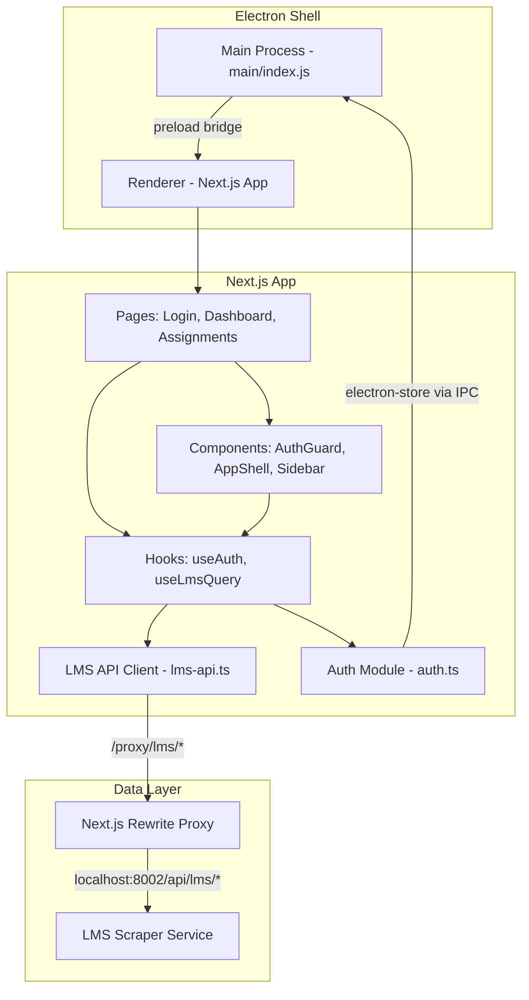

# Design Document: EduPilot LMS Desktop App Completion

## Overview

This design covers completing the EduPilot Desktop App — an Electron + Next.js application for Iqra University students. The app communicates with an LMS Scraper Service (Python/Playwright at localhost:8002) through Next.js proxy rewrites. The work focuses on eight areas: project setup, Microsoft login flow, assignments page (fixing file submission), dashboard data integration, auth guard with session persistence, professional UI and visual design, and error handling with offline resilience.

The existing codebase already has the core structure in place: `lmsApi` client, login page with MFA polling, assignments page (with a mutable ref bug), dashboard page (using raw `useState`/`useEffect`), auth module, offline hook, Electron preload bridge, and TanStack Query installed but underutilized. The design focuses on what needs to change or be added, not a rewrite.

### Key Design Decisions

1. **TanStack Query adoption**: Replace manual `useState`/`useEffect` data fetching in dashboard and assignments pages with `useQuery`/`useMutation` hooks for caching, retry, loading/error states, and background refetching.
2. **React state for file inputs**: Replace `useRef<Record<number, HTMLInputElement>>` pattern in assignments with `useState<Record<number, File | null>>` to fix re-render issues.
3. **Auth guard as a wrapper component**: Create an `AuthGuard` component that checks session validity on mount and wraps protected routes via the layout, rather than duplicating auth checks in every page.
4. **Session persistence via existing preload bridge**: Use the existing `window.electron.setOfflineData`/`getOfflineData` IPC bridge for storing the LMS profile, avoiding new Electron IPC channels.
5. **TanStack Query retry config**: Configure 2 retries with exponential backoff at the `QueryClient` level in `providers.tsx` for transient failure resilience.
6. **White compact theme**: Apply a consistent white/light design system across all pages — no gradients, no heavy shadows, compact spacing with `text-sm`/`text-xs` base typography, flat solid-color buttons, and a neutral gray palette with `blue-600` as the primary accent. The existing dark sidebar (`bg-gray-900`) will be replaced with a light sidebar using a subtle border separator.

## Architecture

The architecture is a layered client-side application running inside Electron:



### Data Flow

1. **Login**: Credentials → `lmsApi.startLogin()` → LMS Scraper → poll `/login/status` → on `logged_in`, persist profile via preload bridge → redirect to dashboard
2. **Dashboard load**: `AuthGuard` verifies session → TanStack Query fetches profile, courses, grades, events concurrently → renders stats, lists, events
3. **Assignment submission**: User selects file (stored in React state) → `lmsApi.submitAssignment()` sends FormData → on success, TanStack Query invalidates assignment cache → list refreshes
4. **Session check on launch**: `AuthGuard` reads persisted profile from electron-store → calls `lmsApi.getProfile()` to verify → valid: show page, invalid: clear store + redirect to login

## Components and Interfaces

### New Components

#### `AuthGuard` (apps/desktop/src/components/AuthGuard.tsx)
Wraps protected routes. On mount, checks for persisted profile and verifies with the LMS scraper.

```typescript
interface AuthGuardProps {
  children: React.ReactNode;
}
// States: 'checking' | 'authenticated' | 'unauthenticated'
// On 'checking': shows loading spinner
// On 'unauthenticated': redirects to /login
// On 'authenticated': renders children
```

### Modified Components

#### `Providers` (apps/desktop/src/app/providers.tsx)
Add retry configuration to `QueryClient`:
```typescript
new QueryClient({
  defaultOptions: {
    queries: {
      staleTime: 60_000,
      refetchOnWindowFocus: false,
      retry: 2,
      retryDelay: (attempt) => Math.min(1000 * 2 ** attempt, 10_000),
    },
  },
});
```

#### `AppShell` (apps/desktop/src/components/AppShell.tsx)
Wrap sidebar-visible pages with `AuthGuard`:
```typescript
// Before: just renders Sidebar + children
// After: renders AuthGuard > Sidebar + children for protected routes
```

#### `Sidebar` (apps/desktop/src/components/Sidebar.tsx)
Add a logout button at the bottom that calls `lmsApi.clearSession()`, clears persisted profile, and redirects to `/login`.

#### `DashboardPage` (apps/desktop/src/app/dashboard/page.tsx)
Replace manual `useState`/`useEffect` fetching with TanStack Query hooks:
- `useQuery(['lms', 'profile'], lmsApi.getProfile)`
- `useQuery(['lms', 'courses'], lmsApi.getCourses)`
- `useQuery(['lms', 'grades'], lmsApi.getGrades)`
- `useQuery(['lms', 'events'], lmsApi.getEvents)`
- `useMutation` for sync with `onSuccess` invalidating all queries

#### `AssignmentsPage` (apps/desktop/src/app/assignments/page.tsx)
- Replace `useRef<Record<number, HTMLInputElement>>` with `useState<Record<number, File | null>>({})`
- Replace manual `useEffect` fetching with `useQuery(['lms', 'assignments', selectedCourse], ...)`
- Use `useMutation` for submission with `onSuccess` invalidating assignment queries
- Add file type validation against allowed extensions before submission

#### `LoginPage` (apps/desktop/src/app/login/page.tsx)
- On successful login (`logged_in` status), persist profile via `window.electron.setOfflineData('lmsProfile', profile)`
- The existing polling logic and MFA display are correct and stay as-is

### Custom Hooks

#### `useLmsProfile` (apps/desktop/src/lib/hooks/use-lms-profile.ts)
Encapsulates reading/writing the persisted LMS profile from electron-store:
```typescript
function useLmsProfile() {
  getProfile(): LMSProfile | null    // reads from electron-store
  setProfile(p: LMSProfile): void    // writes to electron-store
  clearProfile(): void               // removes from electron-store
}
```

### Existing Interfaces (No Changes)

- `lmsApi` client — all API methods are already correct
- `LMS*` types — all type definitions are complete
- Preload bridge — existing IPC handlers for `get-offline-data`/`set-offline-data` are sufficient
- Next.js proxy rewrite — already configured in `next.config.js`

## Data Models

### Persisted Data (Electron Store)

| Key | Type | Purpose |
|-----|------|---------|
| `lmsProfile` | `LMSProfile \| null` | Cached student profile for session persistence |
| `authTokens` | `AuthTokens \| null` | API gateway tokens (existing, unchanged) |
| `queryQueue` | `QueuedQuery[]` | Offline query queue (existing, unchanged) |

### TanStack Query Cache Keys

| Key | Fetcher | Stale Time |
|-----|---------|------------|
| `['lms', 'profile']` | `lmsApi.getProfile` | 60s (default) |
| `['lms', 'courses']` | `lmsApi.getCourses` | 60s |
| `['lms', 'grades']` | `lmsApi.getGrades` | 60s |
| `['lms', 'events']` | `lmsApi.getEvents` | 60s |
| `['lms', 'assignments', courseId]` | `lmsApi.getAssignments(courseId)` or `lmsApi.getAllAssignments()` | 60s |

### File Submission State (Assignments Page)

```typescript
// Before (mutable ref - buggy):
const fileRefs = useRef<Record<number, HTMLInputElement | null>>({});

// After (React state - correct):
const [selectedFiles, setSelectedFiles] = useState<Record<number, File | null>>({});
```

### Allowed File Extensions

```typescript
const ALLOWED_EXTENSIONS = [
  '.pdf', '.doc', '.docx', '.txt', '.zip',
  '.py', '.java', '.cpp', '.c', '.xlsx', '.pptx'
] as const;
```


## Correctness Properties

*A property is a characteristic or behavior that should hold true across all valid executions of a system — essentially, a formal statement about what the system should do. Properties serve as the bridge between human-readable specifications and machine-verifiable correctness guarantees.*

### Property 1: Assignment card displays all non-null fields

*For any* valid `LMSAssignment` object, when rendered as an assignment card, the output SHALL contain the assignment name, course identifier, submission status, and (when non-null) the due date, grade, and time remaining.

**Validates: Requirements 3.3**

### Property 2: File extension validation accepts only allowed types

*For any* filename string, the file validation function SHALL return `true` if and only if the filename ends with one of the allowed extensions (`.pdf`, `.doc`, `.docx`, `.txt`, `.zip`, `.py`, `.java`, `.cpp`, `.c`, `.xlsx`, `.pptx`), and `false` otherwise.

**Validates: Requirements 4.7**

### Property 3: Average grade computation is correct

*For any* non-empty array of `LMSGrade` objects where at least one grade is non-null, the computed average grade SHALL equal the arithmetic mean of all non-null grade values, rounded to the nearest integer.

**Validates: Requirements 5.2**

### Property 4: Grade color coding maps to correct ranges

*For any* numeric grade value, the grade color function SHALL return green for values ≥ 80, yellow for values in [60, 80), red for values < 60, and gray for null.

**Validates: Requirements 5.4**

## UI/UX Design System

### Design Tokens

The entire app uses a cohesive white/light theme with these design tokens enforced via Tailwind utility classes:

| Token | Value | Tailwind Class |
|-------|-------|---------------|
| Page background | `#F9FAFB` (gray-50) | `bg-gray-50` |
| Card background | `#FFFFFF` | `bg-white` |
| Primary accent | `#2563EB` (blue-600) | `text-blue-600`, `bg-blue-600` |
| Text primary | `#111827` (gray-900) | `text-gray-900` |
| Text secondary | `#6B7280` (gray-500) | `text-gray-500` |
| Text muted | `#9CA3AF` (gray-400) | `text-gray-400` |
| Border color | `#E5E7EB` (gray-200) | `border-gray-200` |
| Border radius | 6-8px | `rounded-md` (6px) or `rounded-lg` (8px) |
| Base font size | 14px / 12px | `text-sm` / `text-xs` |
| Sidebar width | 208-224px | `w-52` or `w-56` |

### Global Constraints

- **No gradients**: Zero `bg-gradient-*` classes anywhere. All surfaces use flat solid colors.
- **No heavy shadows**: Replace `shadow-lg`, `shadow-md` with `shadow-sm` or `border` only. Hover states use `hover:bg-gray-50` background tint, not `hover:shadow-*`.
- **Compact spacing**: Use `p-3`/`p-4` for cards (not `p-6`/`p-8`), `gap-3` for grids, `space-y-1` for nav items. Page padding is `p-6` max.
- **Small typography**: `text-sm` as the base body size, `text-xs` for metadata/labels, `text-lg` for page titles (not `text-3xl`).

### Component Styling Guidelines

#### Buttons
```
Primary:   bg-blue-600 text-white text-sm px-3 py-1.5 rounded-md border border-blue-700 hover:bg-blue-700
Secondary: bg-white text-gray-700 text-sm px-3 py-1.5 rounded-md border border-gray-300 hover:bg-gray-50
Disabled:  opacity-50 cursor-not-allowed
```
No gradients, no `shadow-*` on buttons.

#### Cards
```
bg-white border border-gray-200 rounded-lg p-3 or p-4
Hover: hover:bg-gray-50 (not hover:shadow-md)
```

#### Badges / Status Pills
```
text-xs px-2 py-0.5 rounded-full border font-medium
Green:  bg-green-50 text-green-700 border-green-200
Yellow: bg-yellow-50 text-yellow-700 border-yellow-200
Red:    bg-red-50 text-red-700 border-red-200
Blue:   bg-blue-50 text-blue-700 border-blue-200
```

#### Inputs
```
text-sm border border-gray-300 rounded-md px-3 py-1.5 bg-white
Focus: focus:ring-2 focus:ring-blue-500 focus:border-blue-500
```

### Page-Specific Styling

#### Login Page (Requirement 7.6)
- Light neutral background: `bg-gray-50` (not `bg-gray-900`)
- Centered card: `min-h-screen flex items-center justify-center`
- Card: `bg-white border border-gray-200 rounded-lg p-6 w-full max-w-sm`
- No decorative gradients or heavy imagery
- EduPilot branding: emoji + `text-lg font-semibold` title

#### Sidebar (Requirement 7.7)
- Light background: `bg-white` with `border-r border-gray-200` separator (replacing `bg-gray-900`)
- Fixed width: `w-52` (208px) — within the 200-220px range
- Nav items: `text-sm` with small icon + label, `py-2 px-3` padding
- Active state: `bg-blue-50 text-blue-700` (not `bg-blue-600 text-white`)
- Hover state: `hover:bg-gray-50` (background tint, no shadow)
- Logo area: compact with `py-3 px-4 border-b border-gray-200`

#### Dashboard (Requirement 7.4)
- Stats row: `grid grid-cols-4 gap-3` with compact cards (`p-3`)
- Course/grade lists: compact cards with `p-3`, `space-y-2`
- Events grid: `grid grid-cols-2 gap-3` with `p-3` cards
- Page title: `text-lg font-semibold` (not `text-3xl font-bold`)
- All cards: `bg-white border border-gray-200 rounded-lg` — no `shadow-md`

#### Assignments Page (Requirement 7.5)
- Assignments render as compact rows, not large expanded cards
- Each row: `bg-white border border-gray-200 rounded-lg p-3 flex items-center`
- Inline status badge, due date, and action button on the same row
- Submission form collapses into the row with a toggle/expand pattern
- Alternating row tints: `even:bg-gray-50` for visual separation

#### Grades Page (Requirement 7.10)
- Table rows: alternating `bg-white` / `bg-gray-50` tints
- Thin dividers: `border-t border-gray-100` between rows
- Compact cell padding: `p-2` or `p-3`

#### Events Page
- Compact event cards with `p-3`, thin left border for type color coding
- `space-y-2` between cards

### Tailwind Config Updates

The existing `tailwind.config.js` needs no theme extensions — all tokens use default Tailwind values. The changes are purely in component class usage, not configuration.

## Error Handling

### Error Categories and Responses

| Error Type | Detection | User Message | Recovery |
|-----------|-----------|-------------|----------|
| LMS Scraper unreachable | `fetch` throws `TypeError` or connection refused | "LMS Scraper Service is not running on port 8002" | Retry button |
| API returns error status | `res.ok === false` in `lmsFetch` | Error detail from response body | Retry via TanStack Query |
| Network offline | `navigator.onLine === false` / `offline` event | Offline indicator in sidebar + banner | Auto-retry when back online |
| Request timeout | `fetch` aborted or no response | "Request timed out. Please try again." | Manual retry button |
| Session expired | `/profile` returns error after persisted profile found | Silent redirect to login | Re-login |
| File validation failure | Extension not in allowed list | "Please select a supported file type" | User selects different file |
| Empty file submission | No file selected in state | "Please select a file first" | User selects a file |

### TanStack Query Error Handling

The `QueryClient` in `providers.tsx` will be configured with:
- `retry: 2` — retry failed queries twice before showing error
- `retryDelay: (attempt) => Math.min(1000 * 2 ** attempt, 10_000)` — exponential backoff capped at 10s
- Each page's `useQuery` hooks will use the `error` state to render error UI
- Mutations (sync, submit) will use `onError` callbacks for specific error messages

### Offline Behavior

- The existing `OfflineProvider` and `useOffline` hook detect online/offline state via browser events
- When offline: sync button, submit button, and login form are disabled
- The sidebar already shows an offline badge via `useOffline`
- TanStack Query will pause retries while offline and resume when back online (default behavior)

## Testing Strategy

### Unit Tests (Jest + React Testing Library)

Focus on specific examples and edge cases:

- **AuthGuard**: Test redirect when no session, render children when authenticated, redirect when session expired
- **Login flow**: Test form submission calls `startLogin`, MFA number display, success redirect with profile persistence, error display
- **Dashboard**: Test that all four queries fire on mount, sync button triggers `scrapeAll`, error state renders message
- **Assignments**: Test course filter changes query, file selection updates state (not ref), submit without file shows validation, successful submission invalidates cache
- **Offline**: Test buttons disabled when offline, offline indicator shows in sidebar
- **UI Theme**: Snapshot tests for key pages (login, dashboard, assignments) to verify no gradient classes, compact spacing, and correct color palette

### Property-Based Tests (fast-check)

Use the `fast-check` library for property-based testing. Each property test runs a minimum of 100 iterations.

- **Property 1** (Tag: `Feature: edupilot-lms-complete, Property 1: Assignment card displays all non-null fields`): Generate random `LMSAssignment` objects with varying null/non-null fields, render the card component, assert all non-null fields appear in the output.
- **Property 2** (Tag: `Feature: edupilot-lms-complete, Property 2: File extension validation accepts only allowed types`): Generate random filename strings (with and without allowed extensions), run through the validation function, assert correct accept/reject.
- **Property 3** (Tag: `Feature: edupilot-lms-complete, Property 3: Average grade computation is correct`): Generate random arrays of `LMSGrade` objects with mixed null/non-null grades, compute the average, assert it matches the expected arithmetic mean.
- **Property 4** (Tag: `Feature: edupilot-lms-complete, Property 4: Grade color coding maps to correct ranges`): Generate random numbers (and null), run through the color function, assert correct color class for each range.

### Integration Tests

- Verify Next.js proxy rewrite configuration in `next.config.js`
- Verify `QueryClient` default options (staleTime, retry, retryDelay)
- End-to-end login → dashboard flow with mocked LMS scraper responses
