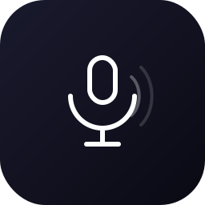

<div align="center">



# Voice to Text

**Local, offline voice transcription — no cloud, no API keys, no subscriptions.**

[](LICENSE)
[](https://github.com/kanirya/voice-to-text/releases)
[](https://github.com/kanirya/voice-to-text/releases/tag/v1.0.0)

<br />

[⬇️ Download for Windows (.exe)](https://drive.google.com/uc?export=download&id=1EQga8KJbJlTJoD4FI4xs4w3k3_8TDNjA) &nbsp;|&nbsp; [View on GitHub](https://github.com/kanirya/voice-to-text)

</div>

---

## What is this?

Voice to Text is a desktop app that transcribes your speech using [OpenAI's Whisper](https://github.com/openai/whisper) model — running entirely on your machine. Press a hotkey from any app, speak, and your transcribed text lands in your clipboard instantly.

No internet connection required. Your audio never leaves your device.

---

## Features

| Feature | Details |
|---|---|
| 🎙️ Floating widget | Always-on-top 48px circle — click to record |
| ⌨️ Global hotkey | `Ctrl+Shift+Space` works from any app |
| 🧠 Local Whisper AI | Runs fully on-device via `@xenova/transformers` |
| 📋 Auto clipboard | Transcribed text copied instantly |
| 🔇 Voice activity detection | Auto-stops recording on silence |
| 🗂️ System tray | Access history, settings, and quit from tray |
| 🌙 Dark theme | Polished dark UI across all windows |
| 🌐 Web app included | Browser-based fallback using Web Speech API |

---

## Download

### Windows

> **[⬇️ Download Voice to Text Setup 1.0.0 (.exe)](https://drive.google.com/uc?export=download&id=1EQga8KJbJlTJoD4FI4xs4w3k3_8TDNjA)**

The installer will guide you through setup. On first launch, you'll choose a Whisper model to download.

### Other platforms

Build from source — see [Development](#development) below.

---

## Whisper Models

Choose your speed vs. accuracy tradeoff during onboarding:

| Model | Size | Speed | Accuracy |
|---|---|---|---|
| tiny.en | ~75 MB | ⚡ Fastest | ★★☆☆ |
| base.en | ~142 MB | 🚀 Fast | ★★★☆ |
| small.en | ~466 MB | 🏃 Medium | ★★★★ |
| medium.en | ~1.5 GB | 🐢 Slow | ★★★★★ |

Models are downloaded once and stored locally. No re-downloads needed.

---

## How It Works

1. Launch the app — a small circle appears on your screen
2. Click the widget **or** press `Ctrl+Shift+Space`
3. Speak — the app detects your voice and stops automatically on silence
4. Your transcribed text is copied to clipboard
5. Paste anywhere

All audio processing and transcription happens locally using the Whisper model you selected.

---

## Development

### Prerequisites

- Node.js 18+
- npm or pnpm

### Setup

```bash
git clone https://github.com/kanirya/voice-to-text.git
cd voice-to-text
```

**Windows / Linux / macOS (automated):**

```bash
# macOS / Linux
chmod +x setup.sh && ./setup.sh

# Windows
setup.bat
```

**Manual:**

```bash
# Desktop Electron app
cd apps/electron
npm install
npm run dev

# Web app (Next.js)
cd apps/desktop
npm install
npx next dev
```

### Build installer

```bash
cd apps/electron
npm run package
# Output: apps/electron/dist/
```

---

## Project Structure

```
voice-to-text/
├── apps/
│   ├── electron/        # Desktop app — Electron + local Whisper
│   │   ├── src/main/    # Main process (tray, hotkey, transcription)
│   │   ├── src/renderer/# UI windows (widget, settings, onboarding)
│   │   └── src/shared/  # Shared types and IPC channels
│   └── desktop/         # Web app — Next.js + Web Speech API
├── setup.sh             # Setup script (macOS/Linux)
├── setup.bat            # Setup script (Windows)
└── package.json
```

---

## License

[MIT](LICENSE) — free to use, modify, and distribute.
